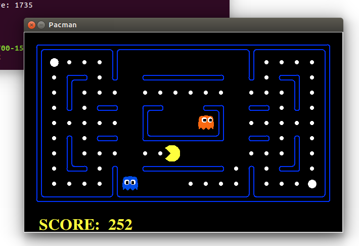

# Pacman-AI-controller

## Breif Introduction of the project
An individual project from the course "Introduction to Artificial Intelligence". Implemented Game Tree Search algorithms (MiniMax, α-β Pruning, Expectimax) into an open source “Pacman Game” to control the “Pacman” collecting points in the maze and dodging the “monsters” to achieve a maximum score



### See "description.pdf" for details, 
### An example of using ReflexAgent with two monsters
```
python pacman.py -p ReflexAgent -k 2
```
